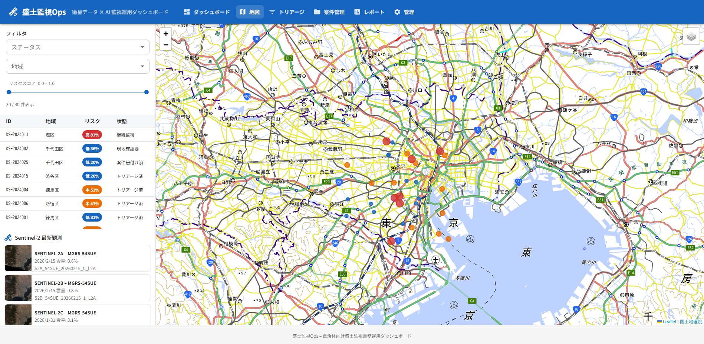
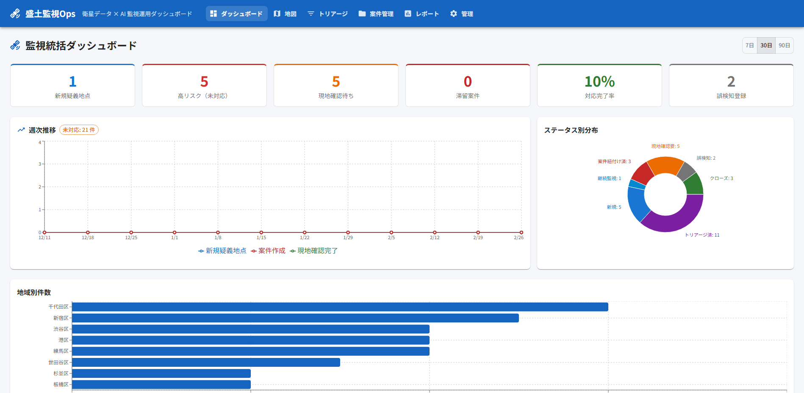
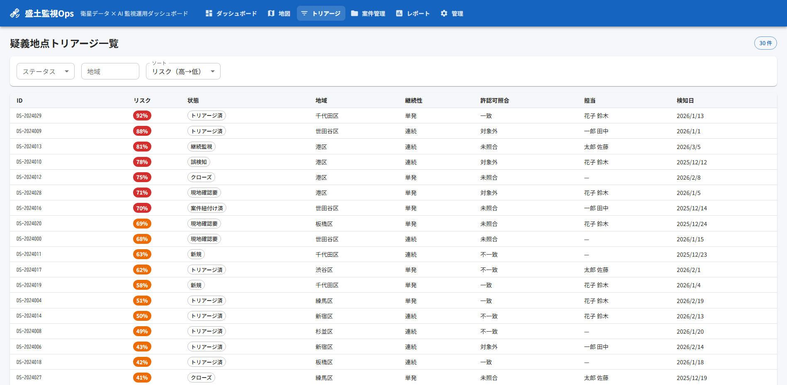
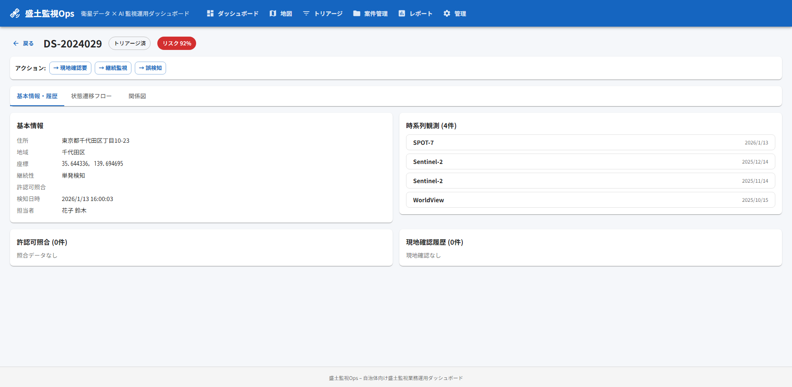
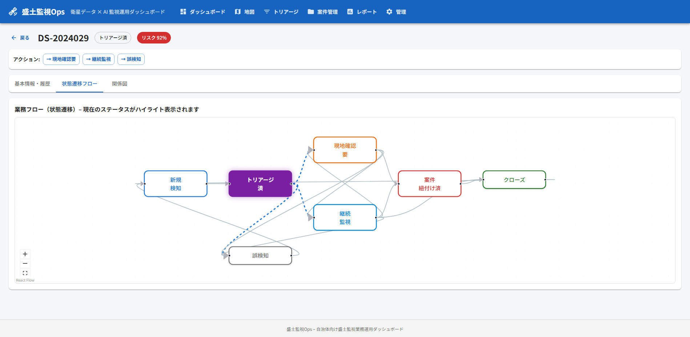
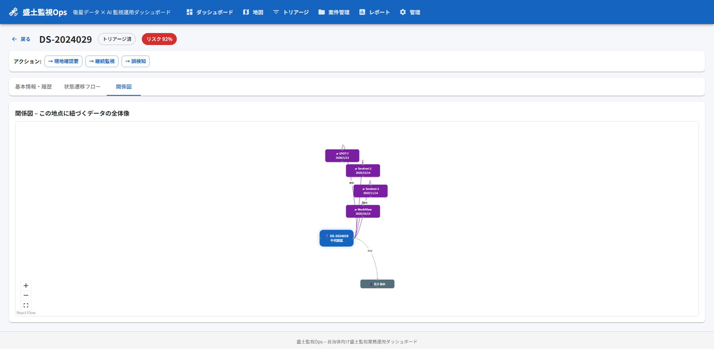

# 🛰️ 盛土監視Ops（Morido Watch Ops）

**衛星から届く画像をつかって、危険な盛り土を早く見つけ、安全に対応するための業務アプリケーション**

---

## 🌍 そもそも「盛土問題」って何？

2021年の熱海市土石流災害をきっかけに、**不適切な盛土（もりど）**が全国的な社会問題になりました。

- 盛土とは、土砂を積み上げて地面を高くする工事のことです
- 法律で定められた手続きを踏まずに行われる盛土や、基準を超えた危険な盛土が各地で見つかっています
- 2023年には「**盛土規制法**」が施行され、自治体には管轄区域内の盛土を監視・管理する責任が課されました

### 自治体が抱えるジレンマ

> 「管轄エリアは広大だが、人手は限られている。どこに危険な盛土があるか、すべてを巡回して確認するのは現実的に不可能」

この問題を解決するために登場したのが、**人工衛星で撮影した画像を使った広域監視**です。衛星の目を借りることで、ヘリコプターを飛ばしたり職員が現地へ行かなくても、地表の変化を定期的に把握できます。

---

## 💡 このアプリは何をするのか

**盛土監視Ops** は、衛星画像の解析結果を受け取り、その後の業務フロー全体をデジタルで管理するためのWebアプリケーションです。

一言でいうと：

> **「見つけたあと、どうするか」を管理するシステム**

### 業務の流れ

```
衛星画像で怪しい場所を検知
    ↓
① 担当者がリスクの高い順に並べ替えて、優先順位をつける（トリアージ）
    ↓
② 必要に応じて、現地に行って目視確認する（現地確認）
    ↓
③ 対応が必要なものは「案件」として登録し、進捗を管理する（案件管理）
    ↓
④ 誰がいつ何を判断したか、記録を残す（証跡・監査ログ）
    ↓
⑤ 管理者は全体状況をグラフやレポートで把握する（ダッシュボード・レポート）
```

**このアプリは上記の①〜⑤をすべてカバーします。**

> ⚠️ **重要**: 本アプリはAIが「ここが怪しい」と候補を出すだけで、「違法である」とは判断しません。最終判断は必ず人間が行います。

---

## 📸 画面紹介

### 🗺️ 地図ビュー — このアプリ最大の特徴


**衛星で見た世界と、行政の地図を重ね合わせて見る**画面です。

- **地図の上のマーカー** が、衛星画像から検知された「要確認地点」を表しています
  - 🔴 赤いマーカー：リスクが高い（70%以上）
  - 🟠 橙のマーカー：中程度のリスク（40〜70%）
  - 🔵 青いマーカー：リスクが低い（40%未満）
  - マーカーが大きいほどリスクが高いことを示します
- **左側のパネル** で、「新宿区だけ表示」「高リスクだけ表示」といった絞り込みができます
- マーカーをクリックすると、**右側にその地点の詳しい情報**が表示されます
- **地図の背景を切り替え** できます：通常の地図、航空写真、衛星画像など

#### 🛰️ リアルタイム衛星画像パネル



画面下部には、ヨーロッパ宇宙機関（ESA）の **Sentinel-2衛星** が最近撮影した画像の一覧が表示されます。これはモックデータではなく、**実際の衛星が撮影した本物の画像**です。雲の量や撮影日も表示されるので、「直近でクリアに撮れた画像はどれか」がすぐにわかります。

---

### 📊 ダッシュボード — 全体状況を一目で把握



管理者向けの画面です。「いま何件の検知地点があるか」「高リスクの未対応が何件か」「先週と比べて増えているか」といった**業務状況の全体像をグラフで表示**します。

- **数値カード**: 新規検知地点数、高リスク未対応数、現地確認待ち、滞留案件数、対応完了率、誤検知数
- **折れ線グラフ**: 週ごとの推移（新規検知・現地確認完了・案件作成の3本線）
- **円グラフ**: いま全体がどういう状態にあるか（新規/トリアージ済/確認中/クローズ…）
- **棒グラフ**: 地域ごとの件数比較

「7日 / 30日 / 90日」のボタンで、どの期間のデータを見るか切り替えられます。

---

### 🔍 トリアージ（優先順位付け）一覧



衛星画像から検知された候補地点の一覧表です。担当者はこの画面で：

- リスクの高い順に地点を確認
- ステータスや地域でフィルタリング
- 行をクリックすると、その地点の詳細ページへ移動

---

### 📋 地点の詳細ページ



個別の地点について、判断に必要な情報がすべてまとまっています：

- 住所、座標、検知日時、リスクスコア
- 過去の観測履歴（いつ、どの衛星で検知されたか）
- 許認可との照合結果（許可されている工事なのかどうか）
- 現地確認の記録（誰がいつ行って、何を確認したか）
- ワンクリックで「次のステップ」へ状態を進められるボタン

---

### 🔀 業務フローの見える化



「この地点は今どの段階にあるのか？次に何をすべきか？」を、フローチャートで表示します。

- 現在の状態が**光って強調表示**されるので、パッと見てわかる
- 次に遷移できるステップが**点滅する矢印**で示される
- 疑義地点・案件それぞれに対応したフローを用意

---

### 🕸️ 関係図 — この地点に関わるすべてを俯瞰



ある地点を中心に、それに関わるデータ（衛星観測、許認可照合、現地確認、案件、担当者など）を**放射状に配置したグラフ**です。「この地点にはどんな情報が紐づいているか」をひと目で確認できます。

---

## 🛰️ 使用している衛星データについて

本アプリは**実際の衛星データ**を使用しています（テスト用の偽データではありません）。

| 項目 | 内容 |
|------|------|
| 衛星 | **Sentinel-2**（欧州宇宙機関 ESA が運用する地球観測衛星） |
| 解像度 | 10m〜60m（地表を10m単位で写せる精度） |
| 撮影頻度 | 同一地点を約5日ごとに撮影 |
| 料金 | **無料**（公共データとして誰でもアクセス可能） |
| 配信元 | [Element84 Earth Search](https://earth-search.aws.element84.com/v1)（STAC API 経由） |

Sentinel-2 は地球の陸地をまんべんなく撮影し続けている衛星です。本アプリでは、東京近郊エリアの最新画像をリアルタイムで検索・表示しています。

---

## 🚀 起動方法

### 必要なもの
- **Python 3.11以上**（バックエンドの実行に必要）
- **Node.js 18以上 / npm 9以上**（フロントエンドの実行に必要）

### 手順 1: バックエンド（サーバー側）の起動

```bash
cd backend
pip install -r requirements.txt       # 必要なライブラリをインストール
python manage.py migrate              # データベースの初期設定
python manage.py seed_morido          # デモ用データの投入（30地点 + 案件など）
python manage.py runserver            # サーバー起動
# → http://localhost:8000 で待ち受け開始
```

### 手順 2: フロントエンド（画面側）の起動

```bash
cd frontend
npm install                           # 必要なライブラリをインストール
npm start                             # 開発サーバー起動
# → http://localhost:3000 で待ち受け開始
```

ブラウザで **http://localhost:3000** を開けばアプリを使えます。

### Docker を使う場合

```bash
docker-compose up --build
# → http://localhost:3000 でアクセス
```

> Docker 起動後、初回のみデモデータの投入が必要です：  
> `docker-compose exec backend python manage.py seed_morido`

---

## 🏗️ 技術的な情報（開発者向け）

<details>
<summary>クリックして技術スタック・API仕様などを表示</summary>

### 技術スタック

#### フロントエンド
| 技術 | 用途 |
|------|------|
| React 19 + TypeScript | UI構築 |
| MUI (Material UI) v7 | UIコンポーネント |
| react-leaflet | 地図表示（国土地理院タイル） |
| @xyflow/react (ReactFlow) | 状態遷移図・関係図 |
| Recharts | グラフ描画 |
| React Router v7 | ページ遷移 |
| Axios | API通信 |

#### バックエンド
| 技術 | 用途 |
|------|------|
| Django 6.0 | Webフレームワーク |
| Django REST Framework | REST API |
| django-cors-headers | クロスオリジン対応 |
| requests | 外部API呼び出し（Sentinel-2） |
| SQLite | 開発用データベース（本番はPostgreSQL + PostGIS想定） |

### API エンドポイント一覧

| メソッド | パス | 説明 |
|---------|------|------|
| `GET` | `/api/v1/dashboard/summary/` | ダッシュボード集計 |
| `GET` | `/api/v1/dashboard/timeseries/` | 週次トレンド |
| `GET` | `/api/v1/detected-sites/` | 疑義地点一覧 |
| `GET` | `/api/v1/detected-sites/{id}/` | 疑義地点詳細 |
| `GET` | `/api/v1/detected-sites/geojson/` | GeoJSON（地図用） |
| `PATCH` | `/api/v1/detected-sites/{id}/status/` | ステータス更新 |
| `POST` | `/api/v1/detected-sites/{id}/screenings/` | トリアージ登録 |
| `GET` | `/api/v1/satellite/search/` | Sentinel-2 シーン検索 |
| `GET` | `/api/v1/satellite/scenes/{id}/` | 衛星シーン詳細 |
| `GET` | `/api/v1/cases/` | 案件一覧 |
| `GET` | `/api/v1/cases/{id}/` | 案件詳細 |
| `POST` | `/api/v1/cases/{id}/comments/` | コメント追加 |
| `GET` | `/api/v1/reports/monthly/` | 月次レポート |
| `GET` | `/api/v1/audit-logs/` | 監査ログ |
| `GET` | `/api/v1/jobs/` | ジョブ一覧 |
| `POST` | `/api/v1/jobs/{id}/retry/` | ジョブ再実行 |

### プロジェクト構成

```
satellite-data-analysis-application/
├── README.md
├── docker-compose.yml
├── backend/
│   ├── manage.py
│   ├── requirements.txt
│   ├── config/                        # Django 設定
│   └── morido/                        # 盛土監視アプリ本体
│       ├── models.py                  #   データモデル定義
│       ├── views.py                   #   API エンドポイント
│       ├── urls.py                    #   URLルーティング
│       ├── satellite_client.py        #   衛星データ取得クライアント
│       ├── management/commands/
│       │   └── seed_morido.py         #   デモデータ投入
│       └── migrations/
├── frontend/
│   ├── package.json
│   └── src/
│       ├── App.tsx                    # アプリ全体のレイアウト
│       ├── theme.ts                   # デザインテーマ
│       ├── api/morido.ts              # API通信
│       ├── types/morido.ts            # 型定義
│       ├── pages/                     # 各画面
│       │   ├── dashboard/             #   ダッシュボード
│       │   ├── map/                   #   地図ビュー
│       │   ├── triage/                #   トリアージ一覧
│       │   ├── site-detail/           #   地点詳細
│       │   ├── cases/                 #   案件管理
│       │   ├── reports/               #   レポート
│       │   └── admin/                 #   管理設定
│       └── components/workflow/       # フロー図・関係図
└── docs/                              # 仕様書・調査資料
```

</details>

---

## 📚 ドキュメント

| 資料 | 内容 |
|------|------|
| [プロダクト概要](docs/01_overview/index.md) | このアプリが何を目指しているか |
| [ビジネス課題](docs/02_business_why/index.md) | 自治体が抱える問題の整理 |
| [機能仕様](docs/03_specification/index.md) | 画面・データ・業務フローの詳細 |
| [アーキテクチャ](docs/04_architecture/index.md) | システム構成・技術設計 |
| [参考資料](docs/05_references/index.md) | 法制度・用語集 |
| [衛星データ調査](docs/00_research/satellite_data_survey.md) | 利用可能な衛星データの比較 |
| [既存サービス調査](docs/00_research/satellite_services_survey.md) | 市場にある類似サービスの調査 |

---

## ⚖️ ご注意

- 本アプリは**業務の意思決定を補助するツール**であり、法的な判定を行うものではありません
- リスクスコアやAIの出力は「確認が必要な候補」を示すものであり、違法性を断定するものではありません
- 衛星画像データは [Copernicus Sentinel-2](https://sentinels.copernicus.eu/)（ESA）のオープンデータを使用しています
- 地図は[国土地理院](https://maps.gsi.go.jp/)のタイルを使用しています

---

## 📄 ライセンス

本プロジェクトはプロトタイプです。ライセンスは未設定です。
