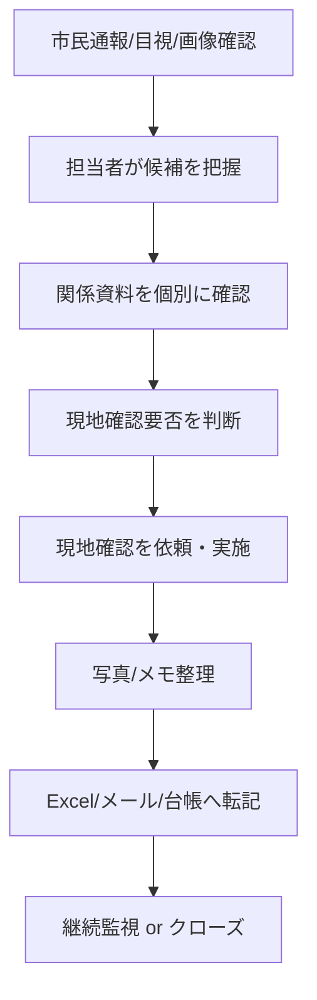

# 02_business_why / index
## 問題領域仕様（Business Why）

## 0. 目的
本章は、「なぜこのプロダクトが必要か」を**業務課題レベル**で定義する。  
ここで確定した問題領域が、後続の解決仕様（03_specification）の制約条件となる。

---

## 1. 対象業務の定義
### 1.1 対象業務（一次対象）
自治体における、危険・違法な盛土等の**監視運用業務**。

本仕様での監視運用業務とは、以下を含む。

- 監視候補の発見
- 優先順位付け
- 現地確認の実施・記録
- 関係情報（許認可等）との照合
- 案件化・継続管理
- 証跡管理・報告

### 1.2 対象外業務（明示）
- 行政処分の意思決定プロセス全体
- 法務判断・訴訟対応
- 土木工学的な安全性評価の高度解析（専門外部委託領域）
- 住民通報受付システムの全面置換

---

## 2. 解くべき根本課題（Problem Statement）
### 2.1 コア課題
**広域・継続的な監視が必要なのに、人手だけでは「どこを先に確認すべきか」を判断しきれない。**

### 2.2 課題の構造
課題は単一ではなく、次の複合問題である。

1. **探索コストの高さ**
   - 対象範囲が広い
   - 巡回だけでは非効率
   - 手作業画像確認が重い

2. **判断コストの高さ**
   - 似た見え方の地点が多い
   - 都市部では誤認しやすい
   - 一時的な堆積と長期・危険な状態の見分けが難しい

3. **運用コストの高さ**
   - 現地確認指示・記録・共有が分断されがち
   - Excel/メール/紙運用で追跡性が弱い
   - 担当者依存が強い

4. **説明責任コストの高さ**
   - 後から根拠確認が必要
   - いつ誰が何を見て判断したか追跡したい
   - 部署間の認識差が生じやすい

---

## 3. ステークホルダー定義（誰の課題か）
## 3.1 一次ステークホルダー
### A. 監視担当（業務主担当）
- 毎日/毎週、候補を確認する
- 現地確認要否を判断する
- 案件の状態を進める

**困りごと**
- 候補件数が多いと捌けない
- 優先順位の判断が属人化する
- 後から説明しづらい

### B. 現地確認担当（巡回担当）
- 現場に行く
- 写真・メモを取る
- 帰庁後に報告する

**困りごと**
- どこから行くべきか分かりにくい
- 現場で確認すべき観点が揃っていない
- 記録の入力が二重になりやすい

### C. 管理職（統括・承認）
- 監視業務の進捗を把握する
- 滞留案件や高リスク案件を確認する
- 報告・説明資料をまとめる

**困りごと**
- 全体状況が見えにくい
- 数値で把握できない
- 担当者ごとのやり方差を把握しづらい

### D. 関係部署（許認可・都市計画・建築指導等）
- 許認可情報照合
- 関連情報提供
- 判断補助

**困りごと**
- 問い合わせが都度発生する
- 情報が散在している
- 照合結果の記録が残りにくい

## 3.2 二次ステークホルダー
- 住民（安全確保・安心感）
- 委託事業者（調査・測量・解析）
- 監査/内部統制観点の確認者

---

## 4. 現状業務フローと詰まり（As-Is）

### 主な詰まり
- 候補抽出と案件管理が分断
- 許認可照合と現地確認記録が分断
- 証跡が散在し検索しにくい
- 判断の根拠が残りにくい
- 管理者視点の全体可視化が弱い

---

## 5. 課題を仕様化する（Business Requirements）
本プロダクトが満たすべき**ビジネス要件**を、解決手段に依存しない形で定義する。

## BR-01 優先順位の明確化
監視担当は、複数の疑義地点に対して、**確認優先順位**を判断できなければならない。

- 候補地点を比較できること
- 優先判断の根拠が見えること
- 判断履歴が残ること

## BR-02 現地確認運用の効率化
現地確認担当は、巡回対象・確認観点・結果記録を**一連で処理**できなければならない。

- 現地確認前に必要情報が揃っていること
- 現地確認時の記録が標準化されていること
- 記録が案件と紐づくこと

## BR-03 継続管理と証跡化
案件は、単発確認で終わらず、**継続監視・再確認・クローズ**の履歴が追える必要がある。

- 案件状態が明確であること
- 証拠画像/メモ/照合結果が時系列で参照できること
- 誰がいつ変更したか追えること

## BR-04 管理者の運用可視化
管理職は、業務全体を**件数・滞留・対応状況**で把握できなければならない。

- 統括ダッシュボードがあること
- 高リスク案件を把握できること
- 滞留案件が把握できること

## BR-05 属人化の緩和
業務判断や記録方法が個人差に依存しすぎないよう、**画面・入力・状態定義が標準化**されていること。

## BR-06 AI過信の防止
AIの出力は「判定」ではなく「疑義候補・補助情報」として扱い、人の判断責任と境界を明確にすること。

---

## 6. 価値提供の定義（顧客価値）
## 6.1 顧客にとっての価値（自治体）
- 監視対象の見落としリスク低減
- 人手の効率的配分
- 案件処理の滞留抑制
- 説明責任に耐える記録基盤
- 属人運用から標準運用への移行

## 6.2 現場ユーザーにとっての価値
- 今日何を見るべきかが明確
- 現地確認前に情報が揃う
- 記録の二重入力が減る
- 後から案件を追いやすい

---

## 7. 成功条件（ビジネス観点）
> 注: ここでは「期間」や「導入計画」は扱わない。状態としての成功条件のみ定義する。

### 7.1 成功条件（必須）
- 監視担当が、候補一覧から優先順位を付けられる
- 地点詳細画面だけで現地確認前判断に必要な情報が揃う
- 現地確認記録が案件と一体で管理される
- 管理者が業務状況を数値で把握できる
- 監査的に「誰がいつ何を判断したか」を追える

### 7.2 成功条件（拡張）
- 複数部署が同一案件を共通画面で参照できる
- 誤検知の傾向が蓄積され、運用改善に活用できる
- 継続監視対象の再確認漏れを防げる

---

## 8. 非ゴール（価値の切り分け）
本プロダクトの目的は「実務運用の改善」であり、以下を直接の成果としない。

- AI精度コンテストでの最適スコア獲得
- 完全自動判定・無人運用
- 法的責任判断の自動化
- あらゆる地理空間課題への汎用対応

---

## 9. 制約条件（Whyから導かれる制約）
問題領域の性質上、後続仕様は以下の制約を満たす必要がある。

1. **人のレビュー工程を削除しない**
2. **監査ログを必須にする**
3. **案件管理を別システム前提にしない（本プロダクト内で持つ）**
4. **誤検知をゼロ前提にしない**
5. **地点単位の時系列証跡を保持する**
6. **自治体業務で理解できる表現を使う（ML専門表現のみでUIを構成しない）**

---

## 10. 解決領域への引き継ぎ（要件の橋渡し）
本章のビジネス要件に対応して、03_specificationでは以下を定義する。

- BR-01 → トリアージ一覧、リスクスコア、優先判定履歴
- BR-02 → 現地確認ワークフロー、入力フォーム、巡回対象一覧
- BR-03 → 案件状態遷移、証跡データ、監査ログ
- BR-04 → 統括ダッシュボードKPI
- BR-05 → 状態定義、入力テンプレート、権限設計
- BR-06 → UI文言、AI出力の扱い、最終判断の責任境界

---

## 11. 章末まとめ（確定した問題領域）
本プロダクトが解くべき対象は、**「危険・違法盛土の監視運用業務の実務ボトルネック」**である。  
核心は「発見」だけでなく、**優先順位・現地確認・案件管理・証跡化**を一体で扱う点にある。
