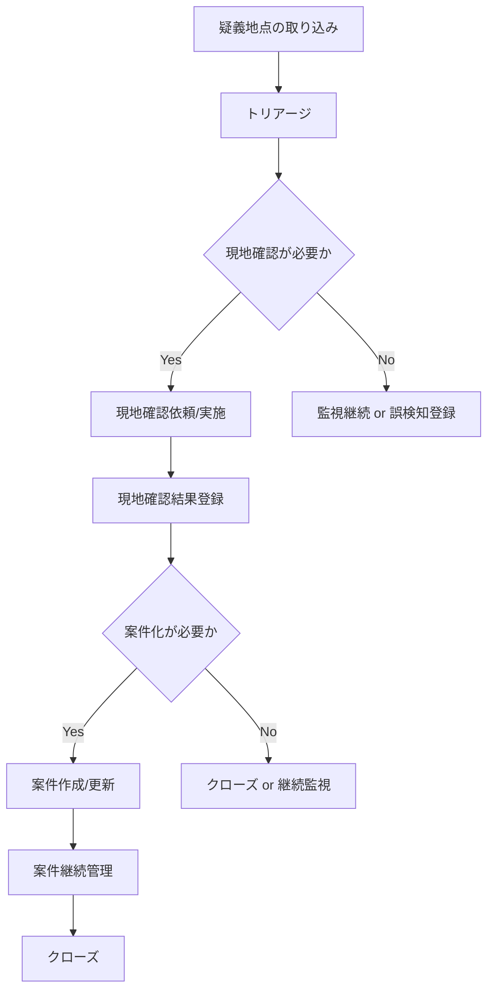
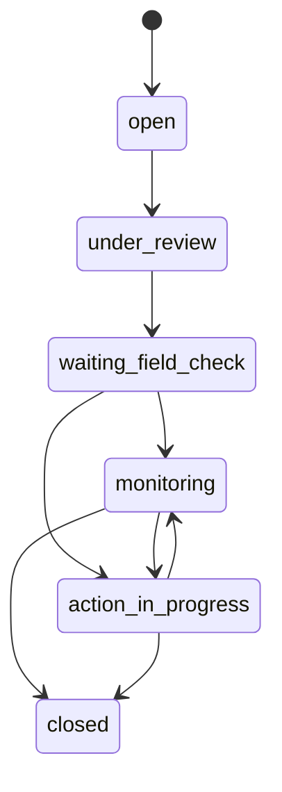
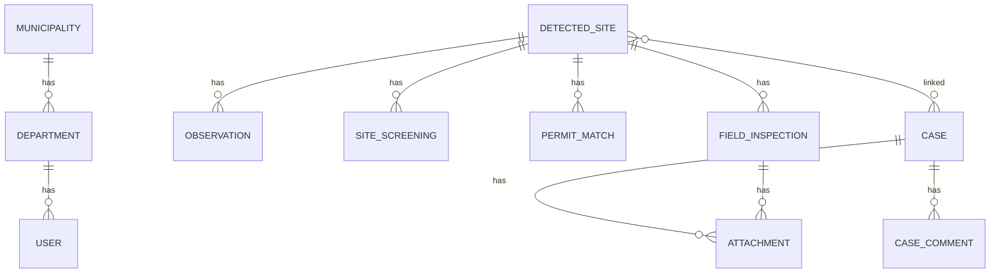

# 03_specification / index
## 解決領域仕様（Product Specification）

## 0. 目的
本章は、02_business_whyで定義した問題領域を解決するための、**機能・画面・データ・業務フロー・ルール**を仕様として定義する。

---

## 1. プロダクトスコープ（機能境界）
### 1.1 本プロダクトが提供する機能
- 疑義地点の管理（一覧・詳細）
- トリアージ（優先順位付け）
- 許認可等との照合結果管理
- 現地確認運用（記録・添付）
- 案件管理（状態遷移・コメント・期限）
- 証跡管理（画像・ログ・履歴）
- 統括ダッシュボード（業務KPI可視化）
- レポート出力（月次サマリ）

### 1.2 本プロダクトが直接提供しない機能
- 衛星データ調達契約管理
- 住民向け通報窓口UI
- 行政処分文書作成の全面支援
- GIS基盤のフル代替（既存GISは併用可）
- 最終的な違法性判定の自動化

---

## 2. ユーザーロールと権限
## 2.1 ロール定義
| ロール | 主な責務 | 代表操作 |
|---|---|---|
| `viewer` | 閲覧のみ | ダッシュボード閲覧、案件閲覧 |
| `operator` | 監視・トリアージ・案件更新 | 候補確認、トリアージ、案件更新 |
| `inspector` | 現地確認担当 | 現地確認登録、写真添付 |
| `manager` | 統括・承認・運用監視 | 全件閲覧、状態変更、レポート |
| `admin` | システム管理 | ユーザー管理、設定、ジョブ再実行 |

## 2.2 権限制御方針
- 権限は **RBAC（Role-Based Access Control）**
- 行政組織構造（自治体/部署）単位でデータ可視範囲を制御
- 監査ログは、権限に関わらずシステム側で強制記録

---

## 3. 業務フロー仕様（To-Be）
## 3.1 監視運用の標準フロー

## 3.2 重要ルール
- 疑義地点は、**違法確定ではない**
- 現地確認の結果は、案件に紐づけて保持する
- 案件状態変更時は監査ログ必須
- 誤検知判定もデータとして保持（将来の改善資産）

---

## 4. 画面仕様（一覧）
本節では、主要画面と責務を定義する。

### 4.1 画面一覧
| 画面ID | 画面名 | 主利用者 | 主目的 |
|---|---|---|---|
| `SCR-001` | 監視統括ダッシュボード | manager / viewer | 業務KPI可視化（Recharts LineChart/PieChart/BarChart） |
| `SCR-002` | 疑義地点トリアージ一覧 | operator / manager | 優先順位付け |
| `SCR-002b` | **地図ビュー（MapPage）** | operator / manager | **GSI地図+衛星データ統合可視化・リスク分布・Sentinel-2パネル** |
| `SCR-003` | 疑義地点詳細 | operator / inspector / manager | 判断・証跡確認（**ReactFlow状態遷移図・関係図**） |
| `SCR-004` | 現地確認登録 | inspector / operator | 現地結果記録 |
| `SCR-005` | 案件一覧 | operator / manager | 継続管理 |
| `SCR-006` | 案件詳細 | operator / manager | 状態遷移・コメント・証跡管理（**ReactFlow状態遷移図**） |
| `SCR-007` | レポート出力 | manager | 月次集計出力（**Recharts統合**） |
| `SCR-008` | 管理設定 | admin | 監査ログ・ジョブ管理 |

> **全画面はMUI (Material UI) コンポーネントで統一実装済み**（AppBar, Card, Table, Chip, Drawer, Tabs, ToggleButtonGroup等）。

---

## 5. 画面仕様（詳細）

## 5.1 SCR-001 監視統括ダッシュボード
### 目的
監視業務の全体状態（件数・滞留・高リスク・処理状況）を把握する。

### 表示項目（必須）
- 新規疑義地点数（期間内）
- 高リスク件数（未対応）
- 現地確認待ち件数
- 滞留案件数（しきい値以上）
- 対応完了率
- 地域別件数（地図/ヒートマップ）
- 状態別件数（案件ステータス集計）
- 誤検知登録件数（期間内）

### 操作
- 期間切替（今週/今月/任意）
- 地域フィルタ
- 詳細画面へのドリルダウン

### 受け入れ条件
- managerロールで閲覧可能
- 集計対象期間が明示される
- 各カードから該当一覧へ遷移可能

---

## 5.1b SCR-002b 地図ビュー（MapPage）【実装済み】
### 目的
全疑義地点をリアルタイム衛星データとともに地図上で空間的に把握する。

### レイアウト
- **左パネル（320px）**: フィルタ群＋データテーブル＋衛星パネル
- **中央**: react-leaflet 地図（全画面高さ）
- **右ドロワー（400px）**: 選択地点の詳細

### ベースレイヤー（LayersControl）
- 国土地理院 標準地図 (`https://cyberjapandata.gsi.go.jp/xyz/std/{z}/{x}/{y}.png`)
- 国土地理院 淡色地図
- 国土地理院 航空写真
- Sentinel-2 Cloudless (EOX `https://tiles.maps.eox.at/wmts/...`)

### マーカー表示
- CircleMarker（リスクスコアに応じた色分け: 赤≥0.7 / 橙≥0.4 / 青<0.4）
- マーカーサイズ: リスクスコアに比例
- 選択時: FlyToアニメーションで地図移動

### フィルタ
- ステータス（Select）
- 地域（Select）
- リスクスコア範囲（Slider）

### 衛星パネル
- `/api/v1/satellite/search/` 経由でSentinel-2 L2Aシーンをリアルタイム検索
- サムネイル画像表示
- 撮影日時・雲量・プラットフォーム情報

### 操作
- マーカークリック→右Drawer表示（詳細情報）
- Drawerから疑義地点詳細ページ（`/sites/:id`）へ遷移

---

## 5.2 SCR-002 疑義地点トリアージ一覧
### 目的
疑義地点を比較し、優先順位を付ける。

### 表示形式
- 一覧（テーブル）
- 地図（ポイント/ポリゴン）
- 一覧と地図は選択状態を同期

### 一覧表示項目（必須）
- 疑義地点ID
- リスクスコア
- 検知日時（最新）
- 継続性（単発/連続）
- 許認可照合状態
- 推奨アクション
- 地域（区等）
- 現在状態（未対応/確認待ち/監視中/誤検知等）

### フィルタ条件（必須）
- 期間
- 地域
- リスク帯
- 許認可照合状態
- 現在状態
- 継続性
- 現地確認要否

### 操作（必須）
- 並び替え（リスク、日時）
- 一括タグ付け（任意）
- 詳細画面遷移
- トリアージ判定の保存

### 受け入れ条件
- 100件以上の一覧をページングで閲覧できる
- フィルタ条件をURLクエリとして共有可能
- 選択地点が地図上で強調表示される

---

## 5.3 SCR-003 疑義地点詳細【ReactFlow統合済み】
### 目的
地点単位で、判断に必要な情報を統合表示する。

### タブ構成（MUI Tabs）
- **タブ0: 基本情報・履歴** — 基本情報、観測履歴、許認可照合、現地確認履歴、関連案件
- **タブ1: 状態遷移フロー** — ReactFlow StateFlowDiagram（現在ステータスをハイライト、次の遷移先をアニメーション表示）
- **タブ2: 関係図** — ReactFlow RelationshipGraph（地点を中心に観測・照合・検査・案件・担当者を放射状配置）

### セクション構成（タブ0内）
1. **ヘッダ**
   - 疑義地点ID
   - 現在状態
   - リスクスコア
   - 担当
   - 最終更新日時

2. **地図ビュー**
   - 対象地点位置/範囲
   - 周辺文脈（地図レイヤ切替は任意）

3. **時系列観測**
   - 観測日時一覧
   - 画像/差分表示（UI上は「候補根拠」として表現）
   - 最新/過去の比較

4. **照合情報**
   - 許認可照合状態
   - 関連する照合メモ
   - 未照合理由（必要時）

5. **現地確認履歴**
   - 実施日時
   - 担当者
   - 結果
   - 写真/メモ

6. **判断・トリアージ履歴**
   - 推奨アクション
   - 人手判定
   - 判定理由メモ

7. **監査ログ**
   - 変更内容
   - 変更者
   - 時刻

### 操作（必須）
- 現地確認作成
- 案件作成/紐付け
- 状態更新
- コメント追加

### UI文言上の制約（重要）
- AI出力に対して「違法」と断定する文言を使用しない
- 「疑義」「確認対象」「候補」などの表現を用いる

---

## 5.4 SCR-004 現地確認登録
### 目的
現地確認結果を標準化して記録する。

### 入力項目（必須）
- 対象疑義地点ID（自動）
- 実施日時
- 担当者
- 現地確認結果（選択）
  - 監視継続
  - 誤検知
  - 案件化要
  - 要再確認
- 所見メモ
- 写真添付（複数可）
- 位置情報（任意/可能なら自動）
- 次回確認推奨日（任意）

### バリデーション
- 実施日時は必須
- 結果は必須
- 所見メモは空可（ただし結果により必須化ルールを設定可能）
- 添付ファイル形式は制限（画像/PDF等）

### 受け入れ条件
- 登録後、疑義地点詳細・案件詳細から履歴参照できる
- 登録時に監査ログが記録される

---

## 5.5 SCR-005 案件一覧
### 目的
案件の継続管理を行う。

### 表示項目（必須）
- 案件ID
- 件名（自動生成可）
- 関連疑義地点数
- ステータス
- 優先度
- 担当
- 期限
- 最終更新日時
- 滞留日数

### フィルタ
- ステータス
- 優先度
- 担当
- 期限超過有無
- 地域
- 期間

---

## 5.6 SCR-006 案件詳細【ReactFlow統合済み】
### 目的
案件単位で、進捗・コメント・証跡・関連地点を統合管理する。

### タブ構成（MUI Tabs）
- **タブ0: 詳細・コメント** — 関連疑義地点テーブル＋コメントスレッド（リアルタイム入力＋送信）
- **タブ1: 状態遷移フロー** — ReactFlow StateFlowDiagram（案件用6状態9遷移、現在ステータスハイライト）

### セクション構成（タブ0内）
- 案件基本情報
- ステータス履歴
- 関連疑義地点一覧
- 現地確認履歴（関連）
- 添付一覧
- コメントスレッド（簡易）
- 期限/担当管理
- 監査ログ

### 操作（必須）
- ステータス変更
- 優先度変更
- 担当変更
- コメント追加
- 添付追加/削除（権限に応じて）
- クローズ

---

## 5.7 SCR-007 レポート出力
### 目的
管理者向けの定型集計を出力する。

### 出力種別（必須）
- 月次運用サマリ（CSV/PDF）
- 状態別件数
- 地域別件数
- 高リスク対応状況
- 誤検知内訳（分類済み分）

### 注意
- レポートは意思決定補助であり、法的判定書ではない
- 出力対象期間・抽出条件を明記する

---

## 5.8 SCR-008 管理設定
### 管理対象（必須）
- ユーザー・ロール
- 部署・地域マスタ
- ステータス/優先度マスタ（必要最小限）
- ジョブ実行履歴の確認
- ジョブ再実行（adminのみ）
- しきい値設定（滞留日数、ダッシュボード閾値等）

---

## 6. 状態遷移仕様（疑義地点 / 案件）

## 6.1 疑義地点の状態
### 状態一覧
- `new`（新規）
- `triaged`（トリアージ済）
- `field_check_required`（現地確認要）
- `monitoring`（継続監視）
- `false_positive`（誤検知）
- `linked_to_case`（案件紐付け済）
- `closed`（クローズ）

### 遷移ルール（要点）
- `new` → `triaged` はトリアージ記録必須
- `field_check_required` → `linked_to_case` は案件ID紐付け必須
- `false_positive` は理由分類を推奨（将来必須化可能）
- `closed` は再オープン可能（監査ログ必須）

## 6.2 案件の状態
### 状態一覧
- `open`
- `under_review`
- `waiting_field_check`
- `monitoring`
- `action_in_progress`
- `closed`

### 状態遷移（標準）

### 遷移共通ルール
- ステータス変更時、変更理由メモを任意入力可能（設定で必須化可）
- 変更者・変更日時は自動記録
- 一部遷移は `manager` 権限を要求可能（運用設定）

---

## 7. データ仕様（概念モデル）
## 7.1 主要エンティティ
| エンティティ | 説明 |
|---|---|
| `DetectedSite` | 疑義地点（AI/ルールにより抽出された確認対象） |
| `Observation` | 観測単位（時点ごとの入力/特徴/結果） |
| `SiteScreening` | トリアージ判定の記録 |
| `PermitMatch` | 許認可等との照合結果 |
| `FieldInspection` | 現地確認記録 |
| `Case` | 継続管理の案件 |
| `CaseComment` | 案件コメント |
| `Attachment` | 画像・PDF等添付 |
| `AuditLog` | 操作・変更履歴 |
| `User`, `Department`, `Municipality` | 組織・権限 |

## 7.2 主要関係

---

## 8. 入力・出力仕様（主要）
## 8.1 入力
### システム入力（内部/連携）
- 疑義地点データ（AI/バッチ）
- 観測時点データ
- 許認可照合用データ（CSV等）

### ユーザー入力
- トリアージ判定
- 現地確認結果
- 案件更新（状態・優先度・担当）
- コメント
- 添付

## 8.2 出力
- 画面表示（一覧/詳細/ダッシュボード）
- 月次レポート（CSV/PDF）
- 監査ログ閲覧/エクスポート（必要時）

---

## 9. ルール仕様（業務ロジック）
## 9.1 リスクスコアの扱い
- リスクスコアは **優先順位付け支援値** として扱う
- UI上で「法的判定値」と誤認させない
- スコアの算出根拠の表示は、説明可能な粒度で保持する（例: 継続性、照合不一致等の寄与）

## 9.2 推奨アクションの扱い
- 推奨アクションは AI/ルールによる提案であり、最終判断はユーザーが行う
- ユーザーが提案と異なる判断をした場合、その事実を履歴に残す

## 9.3 誤検知の扱い
- 誤検知登録は削除せず、状態として保持する
- 誤検知理由分類（任意）を持てるようにする
- 誤検知はダッシュボード集計対象とする

## 9.4 添付管理
- 添付ファイルは、対象エンティティ（地点/現地確認/案件）に紐づく
- 削除時は論理削除を基本とし、監査ログを残す

---

## 10. 検索・フィルタ仕様
### 10.1 共通原則
- 一覧画面は全てページング対応
- 検索条件はURLに反映（共有・再現性確保）
- 主要一覧は並び替え可能

### 10.2 検索対象
- 疑義地点ID
- 案件ID
- 地域
- 状態
- 担当
- 日付範囲
- 優先度/リスク帯
- コメント/メモ全文検索（任意・後続拡張）

---

## 11. 監査・証跡仕様
## 11.1 監査ログ記録対象（必須）
- ステータス変更
- 担当変更
- 優先度変更
- トリアージ判定保存
- 現地確認登録/更新
- 添付追加/削除
- 重要設定変更（管理画面）

## 11.2 監査ログ記録項目（必須）
- イベント種別
- 対象種別/対象ID
- 実行者
- 実行日時
- 変更前/変更後（可能な範囲）
- 付帯メタデータ（IP、user-agent等は運用判断）

---

## 12. 非機能要件（プロダクト仕様側）
> 技術詳細は04_architectureに記載。ここでは要件のみ定義。

### 12.1 可用性
- 業務時間帯に安定稼働
- バッチ失敗時の再実行手段を持つこと

### 12.2 性能
- 一覧画面は、通常条件下で実用的な応答速度を確保
- 地図表示に必要な範囲のみ取得する（全件一括描画を避ける）

### 12.3 セキュリティ
- 認証・認可
- 監査ログ
- 添付ファイルアクセス制御
- 通信暗号化

### 12.4 保守性
- 状態定義・しきい値は設定可能
- ログ/エラー追跡可能
- API仕様が文書化されている

---

## 13. 明示的な非要求（誤解防止）
- 「AIだけで違法判定を確定する」機能は要求しない
- 「全自治体共通で一切設定不要」の完全汎用性は要求しない
- 「既存GIS廃止」を前提にしない
- 「モバイル専用アプリ」を初期要求にしない

---

## 14. 受け入れ観点（仕様充足の判断軸）
本章の仕様が満たされているかは、最低限以下で評価する。

1. **業務フロー整合性**
   - 疑義地点 → 現地確認 → 案件管理 → クローズ が無理なくつながる

2. **画面整合性**
   - 一覧/詳細/案件/監査ログの責務が重複・欠落していない

3. **データ整合性**
   - 状態遷移と履歴が矛盾しない
   - 削除より状態管理を優先している

4. **説明責任整合性**
   - 後から判断根拠・履歴を追える

---

## 15. 章末まとめ（解決領域の確定）
本プロダクトは、**「監視運用OS」**として、疑義地点の抽出後に必要な実務（トリアージ、現地確認、案件管理、証跡化）を統合する。  
AIは判断補助であり、UI・状態・履歴の設計が価値の中心である。
