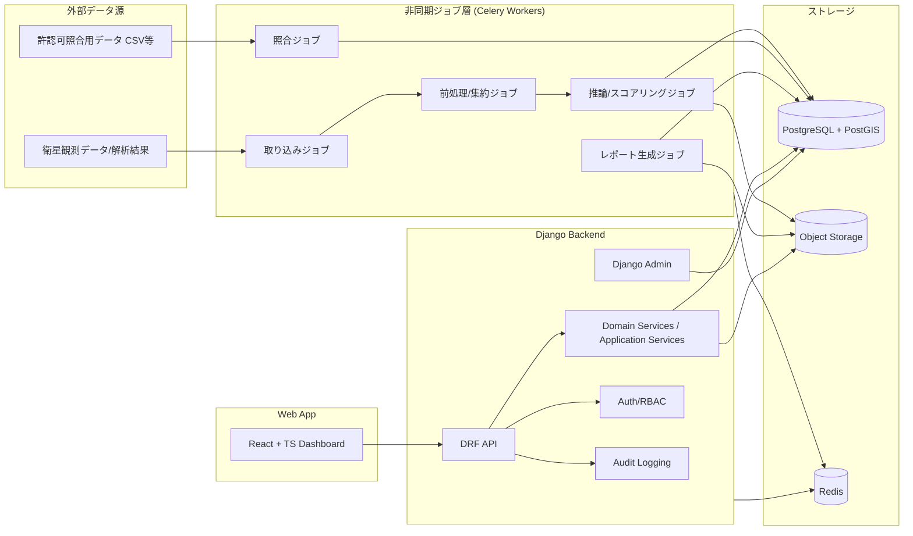

# 04_architecture / index
## アーキテクチャ仕様（React + Django 固定）

## 0. 目的
本章は、03_specificationで定義した機能仕様を、**React + Django** で実装・運用可能な形に落とし込むためのアーキテクチャ仕様を定義する。

---

## 1. 技術スタック（確定）
## 1.1 フロントエンド（固定）
- **React 19**
- **TypeScript** (strict mode, `noImplicitAny`)
- ビルド: Create React App (react-scripts)
- **UIフレームワーク: MUI (@mui/material, @mui/icons-material, @emotion/react, @emotion/styled)**
- ルーティング: React Router v7
- **地図表示: react-leaflet + 国土地理院タイル + Sentinel-2 Cloudless (EOX)**
- **フロー図: @xyflow/react (ReactFlow) – 状態遷移図・関係図**
- **グラフ: Recharts – KPIチャート・週次トレンド・地域別分布**
- マーカークラスタリング: react-leaflet-cluster

## 1.2 バックエンド（固定）
- **Django 6.0**
- **Django REST Framework**
- Django ORM
- Celery（非同期ジョブ）※将来
- Redis（Celery broker/cache）※将来
- PostgreSQL / PostGIS（本番）、SQLite（開発）
- オブジェクトストレージ（S3互換推奨）※将来
- **衛星データ外部API連携: Element84 Earth Search STAC API (Sentinel-2 L2A)**

### 1.2.1 Django プロジェクト構成
- プロジェクト設定: `backend/config/` (settings, urls, wsgi, asgi)
- 盛土監視アプリ: `backend/morido/` (models, views, urls, satellite_client)
- 衛星データクライアント: `backend/morido/satellite_client.py`

## 1.3 画像・地理空間・AI処理（Django周辺）
- Python（ワーカー）
- GDAL / rasterio / geopandas / shapely / numpy 等
- 推論ランタイム（PyTorch / ONNX Runtime 等は実装判断）
- バッチ/ワーカーとしてDjango本体と分離実行

---

## 2. 全体構成（論理）


---

## 3. アーキテクチャ原則
### 3.1 責務分離
- **React**: 画面表示・操作・入力検証（UI層）
- **Django API**: 業務ルール・状態遷移・権限制御
- **Celery Workers**: 重い処理（取り込み、推論、集計）
- **DB/PostGIS**: 永続化・空間検索
- **Object Storage**: 画像・添付・レポートファイル

### 3.2 APIファースト
- ReactはDjango REST API経由でデータ取得/更新する
- 画面ロジックと業務ルールの二重実装を避ける
- 状態遷移制御は原則バックエンドで実施

### 3.3 監査優先
- 重要更新はアプリケーションサービス経由に統一
- Django Adminによる更新も監査対象に含める方針を持つ

### 3.4 非同期化の明確化
- リクエスト同期内で重い処理を行わない
- ジョブ状態を可視化し、再実行可能にする

---

## 4. フロントエンド設計（React）
## 4.1 フォルダ構成（実装済み）
```text
frontend/src/
  theme.ts                              # MUIテーマ定義
  App.tsx                               # MUI AppBar + React Router
  api/
    morido.ts                           # REST APIクライアント
  types/
    morido.ts                           # 全型定義（strict, no any）
  pages/
    dashboard/DashboardPage.tsx         # KPIカード + Recharts (Line/Pie/Bar)
    map/MapPage.tsx                     # react-leaflet地図、GSIタイル、衛星パネル
    triage/TriagePage.tsx               # MUI Table + フィルタリング
    site-detail/SiteDetailPage.tsx      # MUI + ReactFlow関係図・状態遷移図
    cases/CasesPage.tsx                 # MUI Table + フィルタリング
    cases/CaseDetailPage.tsx            # MUI + ReactFlow状態遷移図
    reports/ReportsPage.tsx             # MUI + Recharts (Line/Pie/Bar)
    admin/AdminPage.tsx                 # MUI Tabs（監査ログ・ジョブ管理）
  components/
    workflow/StateFlowDiagram.tsx       # ReactFlow 状態遷移フロー（site/case対応）
    workflow/RelationshipGraph.tsx      # ReactFlow 関係図（地点中心）
```

## 4.2 状態管理方針
### サーバ状態
- React Queryで管理
- キャッシュキーに検索条件を含める
- 詳細更新後の一覧再取得/部分更新を設計する

### UI状態
- モーダル開閉、選択行、地図レイヤ表示などをローカル/軽量ストアで管理
- フィルタ状態はURLクエリに反映（再現性・共有性）

## 4.3 地図UI設計方針（実装済み）
- **ベースタイル**: 国土地理院（標準地図/淡色/写真）＋ Sentinel-2 Cloudless (EOX)
- **マーカー**: CircleMarker でリスクスコアに応じた色分け（赤/橙/青）とサイズ
- 一覧と地図の選択同期（左パネルのデータテーブルとマーカーが連動）
- 大量件数時はreact-leaflet-clusterでクラスタリング
- GeoJSON API (`/api/v1/detected-sites/geojson/`) で軽量な地図描画用データを取得
- 詳細情報はクリック時にMUI Drawerで表示
- **衛星パネル**: STAC API経由でSentinel-2シーンをリアルタイム検索・サムネイル表示

## 4.4 ReactFlowによるフロー可視化（実装済み）
- **StateFlowDiagram**: 疑義地点（7状態14遷移）と案件（6状態9遷移）の状態遷移図
  - 現在のステータスノードを色つき塗りつぶし + グロー影でハイライト
  - 次の遷移先エッジをアニメーション表示
- **RelationshipGraph**: 疑義地点を中心に観測・許認可照合・スクリーニング・現地確認・案件・担当者を放射状配置
  - エンティティ種別ごとに色分け + 絵文字アイコン
  - ドラッグ・ズーム・パン対応

## 4.5 Rechartsによるデータ可視化（実装済み）
- **LineChart**: 週次トレンド（新規検知数・現地確認完了数・案件作成数）
- **PieChart**: ステータス別分布（ドーナツ型）
- **BarChart**: 地域別件数（横棒グラフ）
- ToggleButtonGroupで期間切り替え（7日/30日/90日）
- Skeleton ローディング状態対応

## 4.4 フロントエンド品質要件
- 型定義をAPIスキーマに整合させる
- エラー表示はユーザー向け文言と開発者ログを分離
- AI出力の文言に断定表現を使わない（文言定数化）

---

## 5. バックエンド設計（Django）
## 5.1 Djangoアプリ分割（推奨）
```text
backend/
  config/                    # settings, urls, wsgi/asgi
  apps/
    authz/                   # 認証・認可・ロール
    orgs/                    # 自治体/部署/ユーザー所属
    observations/            # 観測/疑義地点/スコア
    screening/               # トリアージ
    permits/                 # 許認可照合
    inspections/             # 現地確認
    cases/                   # 案件/コメント/状態遷移
    attachments/             # 添付管理
    dashboards/              # 集計API
    reports/                 # レポート生成・出力
    auditlog/                # 監査ログ
    jobs/                    # ジョブ状態管理・実行制御
```

## 5.2 レイヤ分割（Django内）
- **Views (DRF ViewSet / APIView)**: 入出力/認証/バリデーション入口
- **Serializers**: API用変換・入力検証
- **Services (Application Services)**: 業務ロジック・状態遷移
- **Models**: 永続化モデル
- **Selectors/Queries（任意）**: 読み取り最適化
- **Tasks（Celery）**: 非同期処理

> ポイント: 状態遷移や監査ログ記録をViewに直書きしない。

---

## 6. データベース設計方針（PostgreSQL + PostGIS）
## 6.1 主なテーブル群（概念）
- `municipalities`
- `departments`
- `users`（または認証基盤と連携）
- `detected_sites`
- `observations`
- `site_screenings`
- `permit_matches`
- `field_inspections`
- `cases`
- `case_site_links`
- `case_comments`
- `attachments`
- `audit_logs`
- `job_runs`

## 6.2 地理情報の保持方針
- `detected_sites` に地理型カラムを保持
  - `geom_point`（代表点）
  - `geom_polygon`（対象範囲がある場合）
- 空間インデックス（GiST）を利用
- 検索条件（範囲、地域交差）に応じたクエリ最適化を行う

## 6.3 履歴・監査の設計方針
- 監査ログはアプリケーション監査として別テーブル化
- 業務レコードの「更新履歴」は必要に応じて専用履歴テーブル/スナップショットを持つ
- 論理削除を採用する場合は `deleted_at`, `deleted_by` を統一

---

## 7. API設計方針（DRF）
## 7.1 API分類
### 読み取り系
- ダッシュボード集計
- 一覧取得
- 詳細取得
- 履歴取得

### 更新系
- トリアージ判定
- 現地確認登録/更新
- 案件状態更新
- コメント/添付追加
- 管理設定更新

### ジョブ系
- ジョブ実行要求
- ジョブ状態照会
- ジョブ再実行

## 7.2 APIエンドポイント（実装済み）
```text
# ダッシュボード
GET    /api/v1/dashboard/summary
GET    /api/v1/dashboard/timeseries/           # 週次集計(新規/確認/案件)＆保留件数

# 疑義地点
GET    /api/v1/detected-sites/
GET    /api/v1/detected-sites/{id}/
GET    /api/v1/detected-sites/geojson/         # GeoJSON FeatureCollection (地図用)
POST   /api/v1/detected-sites/{id}/screenings/
PATCH  /api/v1/detected-sites/{id}/status/

# 衛星データ（リアルタイム外部STAC API連携）
GET    /api/v1/satellite/search/               # Sentinel-2シーン検索
GET    /api/v1/satellite/scenes/{scene_id}/    # シーン詳細

# 現地確認
POST   /api/v1/inspections/
PATCH  /api/v1/inspections/{id}/

# 案件
GET    /api/v1/cases/
POST   /api/v1/cases/
GET    /api/v1/cases/{id}/
PATCH  /api/v1/cases/{id}/
POST   /api/v1/cases/{id}/comments/

# 添付
POST   /api/v1/attachments/
DELETE /api/v1/attachments/{id}/

# 監査・レポート・ジョブ
GET    /api/v1/audit-logs/
GET    /api/v1/reports/monthly/
POST   /api/v1/reports/monthly/generate/
GET    /api/v1/jobs/
GET    /api/v1/jobs/{job_id}/
POST   /api/v1/jobs/{job_id}/retry/
```

### 7.2.1 衛星データAPI詳細
- **外部依存**: Element84 Earth Search STAC API (`https://earth-search.aws.element84.com/v1`)
- **認証**: 不要（パブリックAPI）
- **コレクション**: `sentinel-2-l2a` (Sentinel-2 Level 2A)
- **機能**: bbox指定で衛星シーン検索、雲量フィルタ、サムネイル/TrueColor/SCL画像URL取得
- **デフォルトbbox**: 東京近郊 [139.5, 35.5, 140.0, 36.0]
- **`auto_bbox=1`**: 登録地点から自動的にbboxを算出

### 7.2.2 GeoJSON API詳細
- 全疑義地点をGeoJSON FeatureCollectionとして返却
- フィルタ: `status`, `region`, `permit_match_status`, `min_risk`, `max_risk`
- 軽量レスポンス（地図描画に必要な属性のみ）

## 7.3 API共通仕様
- 認証必須（管理者以外の匿名アクセスなし）
- ページング標準化（`page`, `page_size` など）
- 一覧APIは検索条件を明示
- エラー形式を統一（コード、メッセージ、詳細）
- 監査対象更新APIは、実行者情報を必ず取得可能にする

## 7.4 OpenAPI
- DRF + OpenAPI生成（例: drf-spectacular）
- フロントエンド型生成（任意）で型整合性を高める

---

## 8. 非同期ジョブ設計（Celery）
## 8.1 ジョブ種別
| ジョブ種別 | 目的 | 同期/非同期 |
|---|---|---|
| `import_observations` | 観測/疑義地点の取り込み | 非同期 |
| `score_sites` | スコア計算/更新 | 非同期 |
| `match_permits` | 許認可照合 | 非同期 |
| `generate_monthly_report` | 月次レポート生成 | 非同期 |
| `rebuild_dashboard_cache` | 集計キャッシュ再構築 | 非同期 |

## 8.2 ジョブ状態
- `queued`
- `running`
- `succeeded`
- `failed`
- `retrying`
- `cancelled`（任意）

## 8.3 ジョブ管理要件
- 実行履歴を保持
- 失敗理由を記録
- 再実行可能（権限制御あり）
- 管理画面または専用APIで状態参照可能

---

## 9. セキュリティ設計
## 9.1 認証・認可
- 認証方式は組織要件に合わせる（セッション / JWT / SSO連携）
- 認可はRBAC + 所属スコープ
- 管理系APIは `admin` 限定

## 9.2 監査・ログ
- 監査ログは改ざん耐性を意識した設計（少なくとも更新履歴の追跡可能性）
- APIアクセスログ、アプリケーションエラーログを分離
- 重要操作は監査ログに業務文脈（対象ID/状態変更）を残す

## 9.3 添付ファイル保護
- 直接公開URLを避け、署名付きURLまたはアプリ経由配信
- MIME/type・拡張子検証
- マルウェアスキャン（運用要件に応じて）

## 9.4 通信・保存
- HTTPS/TLS
- 機密設定値は環境変数/Secret管理
- バックアップポリシーを定義（DB/ストレージ）

---

## 10. 運用設計（最小構成）
## 10.1 運用対象
- Webアプリ（React配信）
- Django API
- Celery Workers
- Redis
- PostgreSQL/PostGIS
- Object Storage

## 10.2 監視項目（最低限）
- APIエラー率
- API応答時間
- ジョブ失敗率
- キュー滞留
- DB接続数
- ストレージ使用量
- 監査ログ記録失敗（重要）

## 10.3 障害時方針（原則）
- 同期APIは失敗をユーザーに明示
- 非同期ジョブは再実行前提
- 監査ログ記録に失敗した更新は原則成功扱いにしない（整合性重視）

---

## 11. 性能設計方針
## 11.1 読み取り性能
- 一覧APIはページング必須
- 集計系は必要に応じキャッシュ/事前集計
- 地図描画用データは軽量レスポンス化

## 11.2 書き込み性能
- 監査ログ記録を同一トランザクションまたは整合性のある方式で実施
- 添付ファイルアップロードは直列依存を減らす（先にメタ作成/後で完了通知などを検討可）

## 11.3 バッチ性能
- 対象範囲分割（地域・期間単位）
- 再実行時の冪等性設計
- 重複取り込み防止キーを定義

---

## 12. 開発・テスト戦略（仕様レベル）
## 12.1 テスト観点
### フロントエンド
- 画面表示
- フィルタ条件保持（URL）
- 権限による表示制御
- エラー表示

### バックエンド
- 状態遷移
- 権限制御
- 監査ログ記録
- APIレスポンス整合
- ジョブ状態遷移

### 結合観点
- 疑義地点→現地確認→案件化の連携
- 添付/監査ログの整合
- 集計値と明細の整合

## 12.2 重要テストケース（抜粋）
- 権限不足ユーザーが案件状態変更できない
- 状態遷移不正（例: 存在しない遷移）が拒否される
- 現地確認登録時に監査ログが作成される
- 誤検知登録した地点がダッシュボード集計に反映される
- ジョブ失敗時に再実行できる（adminのみ）

---

## 13. デプロイ構成（参考実装方針）
> 本節は提案/見積ではなく、仕様実現のための標準構成イメージ。

### 13.1 構成例
- React静的配信（CDNまたはWebサーバ）
- Django API（WSGI/ASGI）
- Celery Worker（1+）
- Redis
- PostgreSQL/PostGIS
- S3互換ストレージ
- 監視/ログ基盤（任意）

### 13.2 環境分離
- `dev`
- `staging`
- `prod`

### 13.3 環境差分の管理
- 環境変数/シークレット
- DBマイグレーション（Django migrations）
- 設定ファイルの分離

---

## 14. 拡張ポイント（将来互換のための設計余地）
> 初期仕様には含めないが、設計で詰まらないよう余地を確保する。

- SSO連携（自治体認証基盤）
- 既存GISとの双方向連携
- モバイル最適化UI
- 誤検知理由の体系化と分析
- AIモデルバージョン管理UI
- 通知（メール/庁内連携）

---

## 15. アーキテクチャ上の非交渉事項（Must）
1. React + Django 固定
2. 状態遷移制御はサーバ側主導
3. 監査ログ必須
4. 非同期ジョブの状態可視化
5. PostGISを前提とした地理検索設計
6. 添付ファイルアクセス制御

---

## 16. 章末まとめ
本プロダクトのアーキテクチャは、ReactをUI層、Djangoを業務制御層、Celeryを非同期処理層、PostGISを空間データ基盤として分離し、**監視運用OS**としての実務要件（状態遷移、監査、証跡、集計）を安定的に満たす構成とする。
